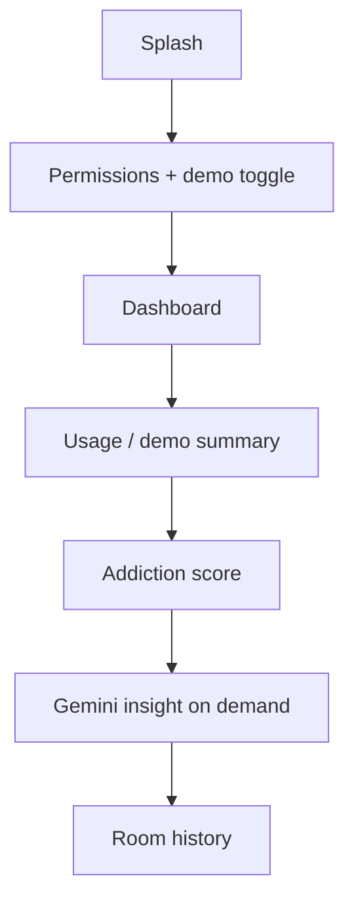

# DoomGuard — AI Scroll Addiction Detector

Hackathon MVP: tracks social app usage (or demo data), computes a **Doomscrolling score**, and calls **Google Gemini** for personalized wellness coaching.

## Setup

1. Open the project in **Android Studio** (Ladybug+). Let it sync Gradle and download SDK 35 if prompted.
2. Create or edit **`local.properties`** in the project root (same folder as `settings.gradle.kts`) and add your Gemini key:

   ```properties
   GEMINI_API_KEY=your_key_here
   ```

   The build injects this into `BuildConfig.GEMINI_API_KEY`. Do not commit real keys.

3. **Usage access**: On a device/emulator, grant *Settings → Apps → Special app access → Usage access* for DoomGuard if you want live stats. **Demo mode** (default) works without it for pitches.

4. Run the **app** configuration on an API 26+ device.

## Stack

- Kotlin, Jetpack Compose, Material 3, Navigation
- MVVM (`DoomViewModel`), coroutines, DataStore, Room
- `UsageStatsManager` + usage events for supported social packages
- Retrofit + OkHttp + Moshi → Gemini `generateContent`
- Optional notification nudges (POST_NOTIFICATIONS on Android 13+)

## App flow



## Screens

- **Splash** → **Permissions** (usage explanation, demo mode)
- **Home**: score, wellness meter, stats, Gemini card, FAB for full AI view
- **History**: saved daily AI reports
- **Settings**: demo mode, nudges, usage settings shortcut

## Gemini

- Abstraction: `GeminiApi`, `GeminiRepository`, `PromptBuilder`
- Default model: `gemini-1.5-flash` (change in `GeminiRepository` if needed)
- Retries with backoff on failure

## License

Hackathon prototype — use as needed for your team’s submission.
